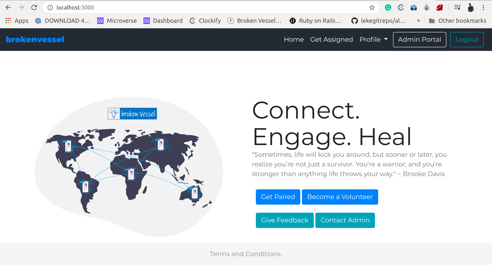

# Broken Vessel

> Broken Vessel is an NGO creating mental awareness and taking care of the depressed. This app enables users to be able to be assigned volunteer listeners

## Built With

- Ruby,
- Ruby on Rails,
- Bootstrap

## Live Demo

[Live Demo Link](http://brokenvessel.herokuapp.com/)

## Authors

👤 **LEONARD RWAI KANYESIGYE**

- Github: [@githubhandle](https://github.com/rmauriutsson)
- Twitter: [@twitterhandle](https://twitter.com/leokanye)
- Linkedin: [linkedin](https://linkedin.com/in/leonard-rwai-kanyesigye)

👤 **EDGAR KANYESIGYE**

- Github: [@githubhandle](https://github.com/isheebo)
- Twitter: [@twitterhandle](https://twitter.com/the_kanyesigye)
- Linkedin: [linkedin](https://linkedin.com/in/kanyesigye-edgar-a560b969/)

## 🤝 Contributing

Contributions, issues and feature requests are welcome!

Feel free to check the [issues page](issues/).

## Show your support

Give a ⭐️ if you like this project!

## 📝 License

This project is [MIT](lic.url) licensed.
